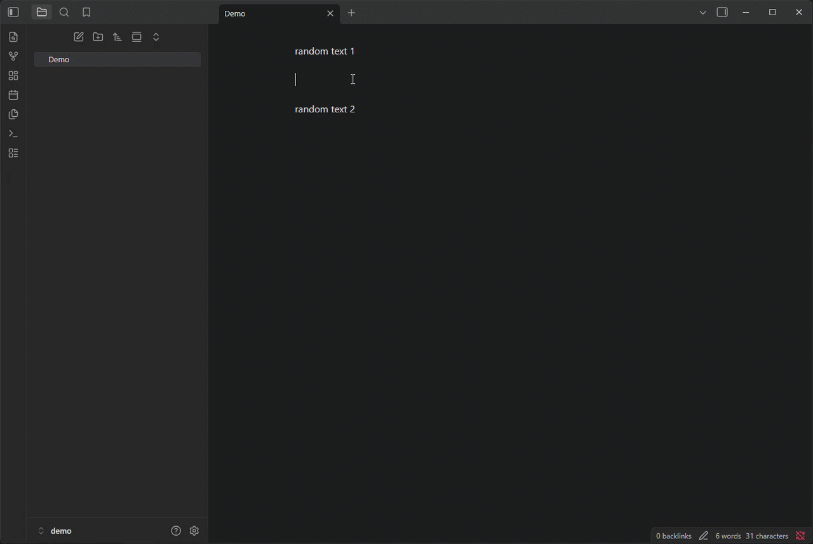

# draw.io Blocks

Edit and render draw.io diagrams directly inside Markdown code blocks using either the hosted diagrams.net editor or an optional offline editor.

Supports desktop and mobile.



## Features

- Renders `drawio` code blocks as SVG previews
- Opens a read-only diagram viewer in a modal or new tab, with controls for zooming and panning
- Opens the diagram editor in a modal or new tab
- Autosaves changes to the original Markdown block
- Supports Obsidian light and dark themes
- Supports online and offline editing
- Optionally shows a preview grid and configurable border
- Optionally stores diagrams as compressed XML

## Requirements

Requires Obsidian 1.13.0 or later.

An internet connection is required for the hosted editor or to download the offline editor. After downloading, the editor and previews work without an internet connection.

## Installation

Install **draw.io Blocks** from **Settings → Community plugins → Browse**.

For manual installation, copy `main.js`, `manifest.json`, and `styles.css` into:

```text
<vault>/.obsidian/plugins/drawio-blocks/
```

Then reload Obsidian and enable the plugin.

## Usage

Create an empty `drawio` code block:

````markdown
```drawio

```
````

Hover over or tap a preview to reveal **View** and **Edit**. Both open in a modal by default, but each can be configured to open in a tab. Editor changes are saved automatically.

In the viewer, drag or swipe to pan; pinch, use the mouse wheel, or select **−** and **+** to zoom. Select **Fit** to reset the diagram.

Open the preview context menu by right-clicking on desktop, pressing and holding on mobile, or using the Context Menu key or **Shift+F10**. From the menu, you can view or edit in a modal or tab, copy the image or XML, and save as PNG or JPG.

## Settings

### Offline mode

**Switch to local editor** displays the draw.io version pinned to the current plugin release. Enable it to download and use the offline editor. Disable it to return to the hosted editor and remove the downloaded files.

### Preview actions

**View button** and **Edit button** independently choose whether the preview buttons open in a modal or a tab. The explicit modal and tab actions remain available from the preview context menu.

### Diagram appearance and storage

**Preview border color** sets the border color around SVG previews.

**Show preview grid** displays a grid behind SVG previews without changing the saved diagram.

**Compress XML** reduces Markdown block size, but makes the contents less readable and produces less useful Git diffs. Existing diagrams are converted the next time they are opened and saved.

### Advanced

**Reset editor preferences** clears preferences stored by the editor. The reset takes effect the next time the editor is opened.

**Reset plugin settings** restores all draw.io Blocks options to their defaults and removes the downloaded local editor.

## Privacy and security

In online mode, the editor and preview renderer are loaded from `https://embed.diagrams.net`, and diagram XML is passed to the hosted iframe through the diagrams.net embed protocol.

In offline mode, diagram XML stays in the local iframe. The downloaded editor comes from the official draw.io GitHub release and is verified against a pinned SHA-256 checksum before installation.

For more information, visit draw.io's [security documentation](https://www.drawio.com/docs/security/) and [privacy policy](https://www.drawio.com/trust/).

## Development

Requires Node.js 20 or newer.

```bash
npm ci
npm run dev
```

Before releasing:

```bash
npm run format
npm run format:check
npm run lint
npm run build
```

## Release

Update the version, commit the changes, create a matching Git tag, and push both:

```bash
npm version <version> --no-git-tag-version

git add -A
git commit -m "<message>"

git tag <version>
git push
git push origin <version>
```

## Attribution

This plugin can download draw.io under the Apache License 2.0 and uses fflate under the MIT License.

This plugin is not affiliated with or endorsed by diagrams.net.
